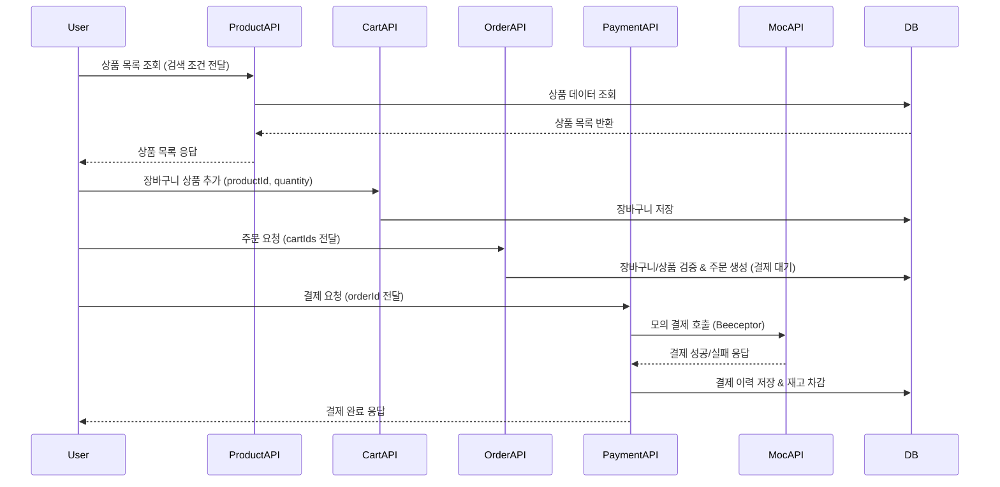

## 🛍️ ShoppingMall API

> Spring Boot 기반의 쇼핑몰 백엔드 시스템
> **주문 → 결제 → 재고 관리 → 장바구니**의 전체 트랜잭션 플로우를 구현한 프로젝트입니다.
> 통합 테스트 및 Swagger 문서화를 통해 안정성과 확장성을 확보했습니다.

---

## 🧱 프로젝트 구조

```
shoppingmall/
├── src/
│   ├── main/
│   │   ├── java/
│   │   │   └── com/example/shoppingmall/
│   │   │       ├── cart/         # 장바구니 도메인
│   │   │       ├── order/        # 주문 도메인
│   │   │       ├── payment/      # 결제 도메인
│   │   │       ├── product/      # 상품 도메인
│   │   │       ├── user/         # 사용자 도메인
│   │   │       └── global/       # 전역 설정, 예외 처리, 공통 유틸
│   │   └── resources/
│   │       ├── application.yml           # 환경 설정 파일
│   │       └── data.sql                  # 테스트용 초기 데이터
│   │
│   └── test/
│       └── java/
│           └── com/example/shoppingmall/
│               ├── cart/
│               │   ├── controller/        # 장바구니 API 단위 테스트
│               │   ├── service/           # 장바구니 서비스 단위 테스트
│               │   └── integration/       # 장바구니 통합 테스트
│               │
│               ├── order/
│               │   ├── controller/        # 주문 API 단위 테스트
│               │   ├── service/           # 주문 서비스 단위 테스트
│               │   └── integration/       # 주문 통합 테스트
│               │
│               ├── payment/
│               │   ├── controller/        # 결제 API 단위 테스트
│               │   ├── service/           # 결제 서비스 단위 테스트
│               │   └── integration/       # 결제 통합 테스트
│               │
│               └── product/
│                   ├── controller/        # 상품 조회 API 단위 테스트
│                   ├── service/           # 상품 서비스 단위 테스트
│                   └── integration/       # 상품 통합 테스트
│
└── build.gradle                            # Gradle 빌드 스크립트
```

---

## 🧩 시스템 아키텍처



---

## ⚙️ 실행 방법

### 🧩 1. 로컬 환경 설정

#### 📦 Database

* **MySQL 8.0 이상**

```bash
CREATE DATABASE shoppingmall CHARACTER SET utf8mb4 COLLATE utf8mb4_general_ci;
```

#### 📁 `application.yml` 설정 예시

```yaml
spring:
  datasource:
    driver-class-name: com.mysql.cj.jdbc.Driver
    url: jdbc:mysql://localhost:3306/shoppingmall?serverTimezone=Asia/Seoul&characterEncoding=UTF-8
    username: your-username
    password: your-password
  sql:
    init:
      mode: never  # never, always(data.sql 실행)
      data-locations: classpath:data.sql
  jpa:
    hibernate:
      ddl-auto: update   # create, update
    properties:
      hibernate:
        format_sql: true
        show_sql: true
    database-platform: org.hibernate.dialect.MySQL8Dialect
    defer-datasource-initialization: true  # Hibernate 이후 data.sql 실행

  profiles:
    active: local

server:
  port: 8080
```

---

### 🧪 2. 테스트

* Swagger 문서: [http://localhost:8080/swagger-ui/index.html](http://localhost:8080/swagger-ui/index.html)
* 단위 테스트: Controller, Service
* 통합 테스트: Product, Order, Payment, Cart 흐름 검증
* MockMvc 기반으로 REST API 요청 시나리오 테스트 포함

---

## ✅ 기술 스택

| 구분             | 기술                            |
| -------------- | ----------------------------- |
| **Language**   | Java 21                       |
| **Framework**  | Spring Boot 3.5.7             |
| **DB / ORM**   | MySQL, JPA, QueryDSL          |
| **Build Tool** | Gradle                        |
| **API Docs**   | Swagger (springdoc-openapi)   |
| **Test**       | JUnit5, Mockito, MockMvc      |
| **Infra**      | H2 (Test), Beeceptor Mock API |
| **Tooling**    | IntelliJ IDEA, Git, GitHub    |

---

## 🔐 인증 및 보안 설정

* **Spring Security** 기반의 인증 흐름을 지원합니다.
  모든 요청은 `Authorization` 헤더를 통해 전달되는 **임시 토큰(Mock Token)** 을 검증하도록 구성했습니다.
* `MockAuthFilter` 는 **JWT 기반 인증을 흉내내는 커스텀 필터 역할**을 수행하여,
  실제 로그인 과정 없이 테스트 환경에서도 **인증된 사용자 요청 흐름을 재현**합니다.

```java
// SecurityFilterChain 설정 예시
@Bean
public SecurityFilterChain securityFilterChain(HttpSecurity http) throws Exception {
    return http
            .csrf(csrf -> csrf.disable())
            .authorizeHttpRequests(auth -> auth
                    .requestMatchers("/swagger-ui/**", "/v3/api-docs/**").permitAll() // Swagger 허용
                    .anyRequest().authenticated()  // 기본적으로 인증된 요청만 허용
            )
            .addFilterBefore(mockAuthFilter, UsernamePasswordAuthenticationFilter.class)
            .build();
}
```

### 🧩 MockAuthFilter 주요 로직

```java
@Override
protected void doFilterInternal(HttpServletRequest request, HttpServletResponse response, FilterChain filterChain)
        throws ServletException, IOException {
    String authHeader = request.getHeader("Authorization");

    if (authHeader != null && authHeader.startsWith("Bearer ")) {
        String token = authHeader.substring(7).trim(); // "mock-user-1"
        if (token.startsWith("mock-user-")) {
            Long userId = Long.parseLong(token.replace("mock-user-", ""));
            UsernamePasswordAuthenticationToken authentication =
                    new UsernamePasswordAuthenticationToken(userId, null, null);
            SecurityContextHolder.getContext().setAuthentication(authentication);
        }
    }
    filterChain.doFilter(request, response);
}
```

---

### 🔑 인증 토큰 사용 방식

| 환경                     | 입력 방식                | 실제 전송 헤더                                   | 결과              |
| ---------------------- | -------------------- | ------------------------------------------ | --------------- |
| **Postman**            | `Bearer mock-user-1` | `Authorization: Bearer mock-user-1`        | ✅ 정상 동작         |
| **Swagger UI**         | `mock-user-1`        | `Authorization: Bearer mock-user-1`        | ✅ 정상 동작         |
| **Swagger UI (오류 예시)** | `Bearer mock-user-1` | `Authorization: Bearer Bearer mock-user-1` | ❌ 403 Forbidden |

> ⚠️ Swagger UI는 자동으로 `"Bearer "` 접두사를 붙이므로,
> **입력 시 `"mock-user-1"`만 입력해야 합니다.**

---

### 🧪 테스트 환경

> 테스트 시에는 `@AutoConfigureMockMvc(addFilters = false)` 설정을 통해
> Spring Security 필터를 비활성화하여 **MockMvc 기반 통합 테스트가 원활하게 동작**하도록 구성했습니다.

---

## 💡 주요 기능 요약

| 도메인               | 기능        | 설명                                |
| ----------------- | --------- | --------------------------------- |
| **상품(Product)**   | 상품 조회     | 카테고리/이름/가격 범위 검색 지원               |
| **장바구니(Cart)**    | 항목 추가 / 조회 / 삭제 | 사용자별 장바구니 관리                      |
| **주문(Order)**     | 주문 생성     | 장바구니 선택 항목 기반 주문 생성               |
| **결제(Payment)**   | 외부 API 결제 처리 | 결제 성공/실패 상태 반영 및 재고 차감            |
| **예외 처리(Global)** | 공통 예외 응답  | `BusinessException`, 500 에러 통합 처리 |
| **테스트**           | 단위/통합 테스트 | API, 서비스, 트랜잭션 검증 완료              |

---

## 🧭 트랜잭션 및 프로세스 흐름 요약 (수정)

1. **상품 조회 (`GET /api/v1/products`)**
    * 검색 조건(category, name, price range)으로 상품 목록 조회
    * 재고 상태(soldOut, stock) 확인

2. **장바구니 담기 / 조회**
    * **담기:** `POST /api/v1/carts` (예: `productId`, `quantity`)
    * **조회:** `GET /api/v1/carts/{userId}`
    * 필요한 상품만 장바구니에 담고 수량 조정

3. **주문 생성 (`POST /api/v1/orders`)**
    * 장바구니에서 **선택한 항목의 ID 목록(`cartIds`)** 전달
    * 재고 검증 후 주문 생성 → 상태: `PENDING_PAYMENT`
    * 선택한 장바구니 항목만 삭제(전체 비우지 않음)

4. **결제 요청 (`POST /api/v1/payments`)**
    * `orderId`(+ 사용자 검증)로 외부 Mock 결제 API 호출
    * **성공:** 주문 상태 `PAYMENT_COMPLETED`, 재고 차감
    * **실패:** 주문 상태 `PAYMENT_FAILED` (재결제 허용)

5. **결제 이력 조회**
    * 주문별: `GET /api/v1/payments/{orderId}`
    * 사용자별: `GET /api/v1/payments/users/{userId}`
> 옵션: **주문 취소 (`POST /api/v1/orders/{orderId}/cancel`)** — 결제 완료된 주문만 취소 가능

---

## 🧪 테스트 계층 구조

| 계층 구분                  | 설명                                                      | 대표 클래스 예시                                                               |
| ---------------------- | ------------------------------------------------------- | ----------------------------------------------------------------------- |
| **Controller 단위 테스트**  | MockMvc 기반으로 HTTP 요청/응답, JSON 직렬화, 상태 코드 검증 수행          | `OrderControllerTest`, `PaymentControllerTest`                          |
| **Service 단위 테스트**     | Mockito로 Repository, 외부 API 호출(mock) 검증. 비즈니스 로직 중심 테스트 | `OrderServiceTest`, `CartServiceTest`                                   |
| **Integration 통합 테스트** | H2 DB + 실제 Bean 주입 기반으로 트랜잭션, DB 연동, 예외 처리까지 검증         | `OrderIntegrationTest`, `CartIntegrationTest`, `PaymentIntegrationTest` |

---

## 📘 테스트 커버리지 (주요 클래스)

| 구분                                     | 클래스명           | 테스트 타입  |
| -------------------------------------- | -------------- | ------- |
| **ProductController / ProductService** | 상품 조회 / 검색     | 단위 + 통합 |
| **CartController / CartService**       | 장바구니 CRUD      | 단위 + 통합 |
| **OrderController / OrderService**     | 주문 생성 / 상태 검증  | 단위 + 통합 |
| **PaymentController / PaymentService** | 결제 요청 / 결과 검증  | 단위 + 통합 |
